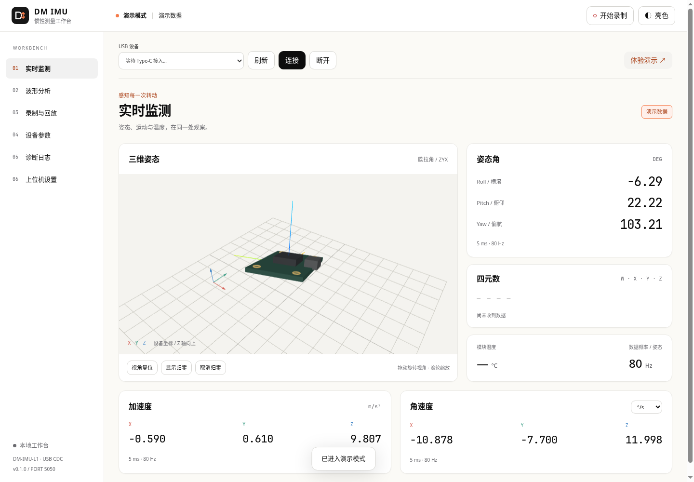

# DM IMU Workbench · 达妙惯性测量工作台

独立的 **DM-IMU-L1 USB 上位机**，提供浏览器工作台和 Agent CLI。采用类似 IterxAI Host App 的 Python 启动方式、侧栏工作区、明暗主题和卡片样式，默认端口 **5050**。



## 快速开始

需要 Python **3.11 或更新版本**。首次安装依赖需要网络；三维和图表资源已随项目提供，运行时不依赖 CDN、Node.js、ROS 或官方 Windows 上位机。

### Linux

```bash
git clone git@github.com:HFO4AR/dmimu_host_app.git
cd dmimu_host_app
./start.sh
```

启动脚本创建 `.venv` 并安装依赖。打开 **http://127.0.0.1:5050**，用支持数据传输的 Type-C 线连接 IMU。

手动启动方式：

```bash
python3 -m venv .venv
source .venv/bin/activate
python -m pip install -r requirements.txt
python app.py
```

### Windows

安装 Python 3.11+（启用 Python Launcher），克隆或下载项目，双击 `start.bat`。也可在 PowerShell 中运行：

```powershell
py -3 -m venv .venv
.\.venv\Scripts\python.exe -m pip install -r requirements.txt
.\.venv\Scripts\python.exe app.py
```

访问同一个 **http://127.0.0.1:5050**。USB 设备由 Python 后端打开，浏览器不需要 Web Serial 权限。

### Type-C 接入

服务每两秒扫描已识别的 DM-IMU USB 设备。只有唯一候选设备时自动连接；多个候选时手动选择。成功连接过的设备按 USB 身份优先重连。手动断开、演示和回放会暂停本次自动连接；需要恢复时点击“连接”或在上位机设置启用自动连接。

实机已确认 DM-IMU-L1 描述能被自动识别，USB VID/PID 为 `6877:4D55`。若其他版本只显示通用 CDC / STM32 串口，首次需要在连接栏选择它并点击“连接”；之后记住其 USB 身份。程序不把所有通用串口都当作 IMU 自动打开。

默认波特率为 921600。打开串口后先接收数据，**不自动保存参数、归零或校准**。没有有效数据时显示具体状态；各通道超过两秒未更新会标注过期。端口打开成功与有效数据接收成功分别显示。

## 工作区

| 工作区 | 功能 |
| --- | --- |
| 实时监测 | 三维姿态、坐标轴、欧拉角、四元数、加速度、角速度、温度与接收频率 |
| 波形分析 | 三类实时曲线、通道图例开关、时间窗口、暂停和拖动缩放；降采样保留极值 |
| 录制与回放 | 原始 USB 数据、接收时间、回放拖动和倍速、CSV 与原始记录下载 |
| 设备参数 | 经确认的旧版 1.x 控制指令、温控、参数回读及校准指令 |
| 诊断日志 | 协议错误、操作结果和有界协议探测 |
| 上位机设置 | 主题、强调色、自动连接、波特率、局域网与 Agent 接入 |

“显示归零”只改变三维画面的参考姿态；设备角度归零是独立设备操作。界面角速度可选 °/s 或 rad/s，记录及 CSV 保留设备原始 rad/s。

“体验演示”必须显式点击；演示、真实 USB 和回放始终显示不同来源。无设备时不会自动伪造数据。

## 固件兼容范围

协议参考为达妙官方 [DM-IMU 仓库](https://gitee.com/kit-miao/dm-imu)，固定核对提交 `ba758fd6106c2b210713bf1ef05800f1688f73c5`；旧控制指令来自历史 V1.2 手册和官方 ROS1 例程。详细证据和格式见 [协议说明](docs/PROTOCOL.md)。

| 能力 | 当前状态 |
| --- | --- |
| USB 测量帧 | 实机验证三轴和四元数约 1 kHz、CRC 无错；设备固件版本未知，温度与状态帧尚待实机验证 |
| 1.x 输出通道、周期、温控与保存 | 已实现公开指令；需先确认固件为 1.x 并在设置选择旧版协议 |
| 1.x 当前参数回读 | 收到新鲜状态帧并匹配参数后才报告回读成功；不宣称断电保存已验证 |
| 1.x 校准和角度置零 | 可显式发送公开指令；缺少完成回报时标为 `uncertain`，不报告校准完成 |
| 2.x 参数、安装方向、量程、航向归零及校准 | **尚未支持**：官方最新手册不提供控制协议，新版上位机与固件仅发布二进制 |
| 固件烧录、CAN、RS485 | 不在首版范围 |

自动接收模式不发送旧版控制指令。不要在未确认版本的 2.x 模块上启用 `legacy-v1`。这份首版不宣称已实现 2.x 的完整设备控制。

### 协议探测

“诊断日志 → 协议探测”只对真实 USB 设备开放。确认后最多三次发送 V1.2 已公开的设置状态查询并退出设置模式，保存原始请求、应答和校验结果。不会扫描全部命令 ID、修改参数或保存配置。发现状态应答也不等于识别了新固件控制协议。

## Agent 控制

服务运行后，同用户 Agent 可用系统 Python 零配置访问。CLI 只依赖标准库，不直接打开串口。

```bash
python3 agent_cli.py capabilities
python3 agent_cli.py status
python3 agent_cli.py ports
python3 agent_cli.py action connect --params '{"port":"/dev/ttyACM0"}' --idempotency-key connect-001
python3 agent_cli.py action record.start --idempotency-key record-001
python3 agent_cli.py action record.stop --idempotency-key stop-001
python3 agent_cli.py recordings
```

Windows 使用 `py -3 agent_cli.py`，端口使用实际 `COM` 编号；复杂 JSON 建议使用 `--params-file`。CLI stdout 是单个 JSON 文档，成功退出码为 0，失败或写操作结果未知为 2。

详见 [Agent 使用指南](docs/AGENT_GUIDE.md) 与 [API 接口](docs/API.md)。

## 本机数据与局域网

默认运行目录：

- Linux：`${XDG_STATE_HOME:-~/.local/state}/dmimu-workbench`
- Windows：`%LOCALAPPDATA%\DM-IMU-Workbench`

目录保存设置、私有凭据、操作记录、录制和探测结果。Linux 设置与凭据限制为本人可读写，Windows 使用当前用户 ACL；这些文件不进入 Git。记录 `.dmimulog` 是版本化 JSONL，含原始数据块和主机时间。

可用 `--data-dir` 指定另一个**支持私有权限的本机目录**；CLI 必须使用相同目录。Linux 下不要把私有数据放到会忽略 chmod 的 FAT/exFAT 等共享挂载盘。一个运行目录只允许一个实例。

默认本机浏览器免登录。通过“上位机设置 → 安全与局域网”创建密码并启用局域网，重启后监听 `0.0.0.0:5050`，其他电脑需登录。服务器接入与控制协议设置只允许本机网页修改。

远程 Agent 必须通过 HTTPS 反向代理，显式指定地址和私有 Token 文件。CLI 不接受远程明文 HTTP。配置可信代理时使用 `--trusted-proxy 127.0.0.1`，代理需传递 `X-Forwarded-For`、`X-Forwarded-Proto` 和 `X-Forwarded-Host`；不要将未知代理设为可信。

```bash
python app.py --port 5050
python app.py --demo                  # 明确以演示数据启动
python app.py --no-auto-connect       # 启动但暂不扫描设备
python app.py --dev                   # 本机开发服务，无自动重载
```

## 常见问题

- **没有 USB 串口**：确认使用数据线，检查 Linux `ls /dev/serial/by-id/` 或 Windows 设备管理器。Linux 不显示未接设备的主板 `ttyS` 串口。
- **Permission denied**：查看设备节点的组和当前用户权限。Fedora 常见为 `dialout`，将当前用户加入实际设备所属组后重新登录；不要用 root 运行整个工作台。
- **打开但没有数据**：检查模块输出是否选择 USB、所需通道是否启用；2.x 设置需要支持该固件的官方工具，不能靠旧指令猜配置。
- **CRC 错误增长**：检查线缆和供电；只有确实使用旧 CRC 变体时才启用兼容选项。
- **端口占用**：关闭其他持有 IMU 的上位机。5050 被占用时本程序会报错，不停止其他服务；可用 `--port` 改端口。
- **Agent 找不到 Token**：先启动服务，核对是否同一用户及数据目录。使用 `--host-url` 时必须同时提供 `--token-file`。
- **回放限制**：首版单次加载最多 100 MiB / 50 万帧；更大的录制仍可流式导出 CSV。拔出设备会结束录制，重连后需重新开始。

## 开发与验证

```bash
python -m unittest discover -s tests -v
python -S agent_cli.py --help
node --check static/app.js
node --check static/charts.js
node --check static/pose.js
```

GitHub Actions 配置 Linux / Windows、Python 3.11 / 3.14 的测试矩阵。当前本机验证结果见 [验证记录](docs/VALIDATION.md)，模拟、浏览器和实机证据分别记录。

后端按协议、串口服务、存储录制和 Web 接口拆分；前端按工作台、三维姿态和曲线拆分。第三方前端资源与许可证保存在 `static/vendor/`。
