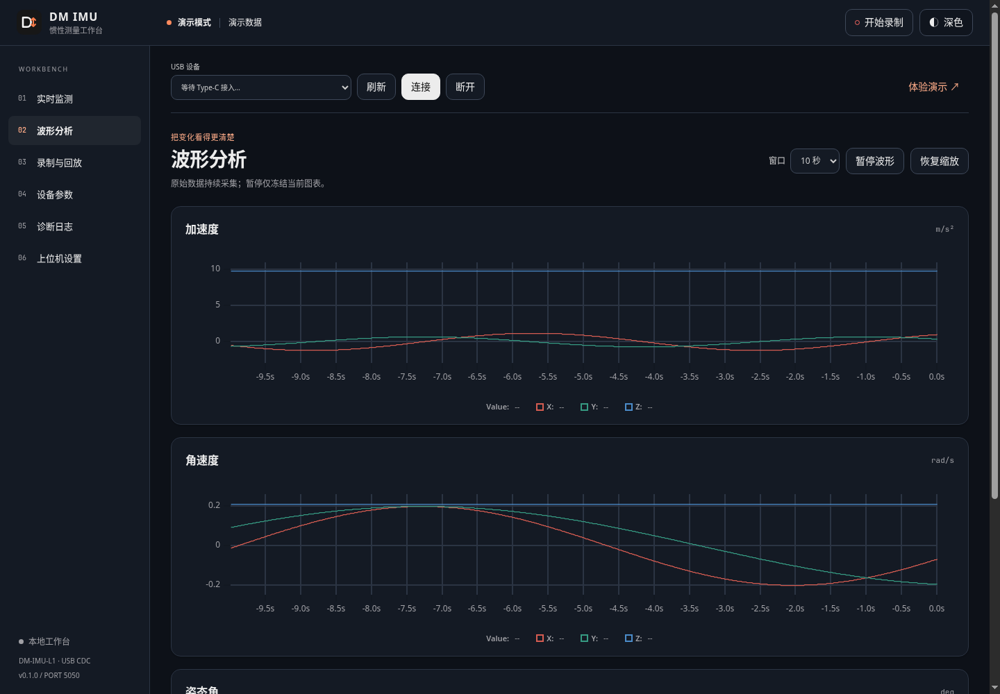

# 验证记录

验证日期：2026-10-01。当前本机为 Linux，Python 3.14.7，正式服务由 Waitress 在 `127.0.0.1:5050` 运行。

## 自动测试

`python -m unittest discover -s tests -v`：**35 项全部通过**。

- 协议：CRC 参考向量、所有拆包边界、15000 帧混合流、错误重同步、两种温度帧长度、非有限值过滤、兼容 CRC 与噪声缓冲限制。
- 服务：连接不写配置、设备选择与歧义处理、旧连接数据隔离、逐通道过期、幂等与重启未知状态、录制导出回放、未知固件禁止旧版控制、参数校验先于发送、校准结果不冒充成功、有界查询原始应答保留。
- Web：浏览器 CSRF / Origin、Agent 独立鉴权、远程 HTTPS、本机设置范围、秘密不公开、设置原子校验，以及修改局域网密码后撤销旧会话。

Python 编译检查、三份前端模块的 `node --check` 和 `python3 -S agent_cli.py --help` 均通过。GitHub Actions 配置 Ubuntu / Windows × Python 3.11 / 3.14；实际 CI 结果以仓库运行记录为准。

## 真实服务与浏览器

使用系统 Python 的 `-S` 模式调用 CLI，验证在没有 Flask 依赖的 Agent 进程中自动发现私有凭据，并完成：

1. 查询真实运行的服务状态及空 USB 端口列表。
2. 显式进入演示模式，开始及停止原始录制。
3. 导出并下载 CSV 与 `.dmimulog`；CSV 有 **345 行数据**，保留加速度 m/s²、角速度 rad/s、欧拉角 deg。
4. 打开该记录，定位到中间、设置 2 倍速和暂停，核对返回状态。
5. 断开并返回无数据源。

浏览器验证了 Three.js 实际渲染、实时 uPlot 曲线、明暗主题、从列表打开回放、自动协议模式下设备控制禁用、390 px 移动布局及没有页面脚本错误。截图为演示或回放数据，不能作为实机效果证据。

## 尚未验证

本机仅枚举到主板串口，没有 USB IMU，因此尚未验证真实 Type-C 枚举身份、供电与数据输出、设备拔插重连、1.x 配置回读及校准效果。没有向真实模块发送任何查询或设置指令。

官方资料未公开 2.x 控制协议。本项目实现测量帧解析并提供固定查询抓包入口；**2.x 参数和校准仍未实现**，不将模拟测试结果视为设备兼容证明。

Windows 启动脚本与权限逻辑已实现，但本机不能运行 Windows GUI 或真实 COM 设备；CI 通过也只覆盖软件测试。
