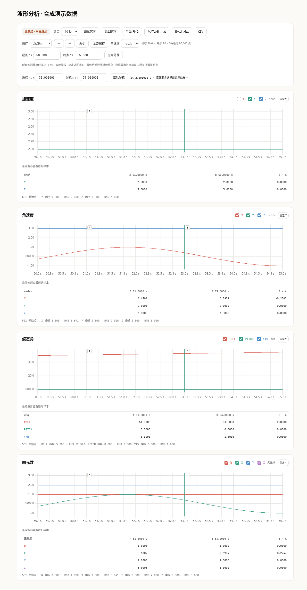

# 波形分析

波形工作区同时显示加速度、角速度、欧拉角和四元数。四图共享时间范围，鼠标悬停读数、双游标及统计使用原始采样点。曲线为显示性能保留各轴极值进行抽点；数据导出不采用抽点结果。



上图由确定性的合成序列生成，只用于展示界面，不包含真实测量、串口信息或设备元数据。

## 实时查看与暂停分析

- 窗口可选 1、5、10、30、60 秒。默认跟随最新样本；四张图使用同一时间起点。
- “暂停波形”保存当前缓存快照；网页继续接收数据。移动范围、框选缩放和双游标分析当前冻结快照。
- “返回实时”或“继续实时”释放快照、清除游标，并跟随最新数据。
- 浏览器实时缓存同时受 90 秒和每通道 90,000 点限制。暂停快照也不超过此上限；持续暂停不会无限累积内存。
- 数据源切换或回放跳转清空图表、冻结快照、纵轴锁定和时间起点。后台采集与录制由服务维护，图表暂停不会暂停设备。

时间轴以网页本次数据源的首个原始样本为起点。实时数据使用主机接收时间；回放使用录制里的原始接收时间 `measurement_time`，因此回放倍速不会改变时间单位或 FFT 采样频率。它不是 IMU 硬件时钟，也不表示每个通道同时采样。

设置页可选 10、20、30、60 Hz 重绘上限，并切换中英文和六种强调色。刷新率只限制浏览器绘图，采样缓存、USB 接收及原始录制不丢弃数据；实际刷新还受采样请求频率与浏览器调度影响。

## 缩放、游标与纵轴

操作选择器提供框选缩放、拖动平移和双游标。选择双游标后可点击放置 A、B，拖动游标线，或在输入框精确修改时间。表格显示每个通道距离游标最近的原始点、实际点时间及 B − A 数值差；工具栏显示所选游标时间差。超出通道已有数据时间范围时显示空读数。

| 操作 | 效果 |
| --- | --- |
| 框选图内时间区域 | 暂停并同步缩放四图 |
| Ctrl + 滚轮 | 以指针位置为中心同步缩放 |
| 左右平移按钮 | 移动半个窗口 |
| 全部缓存 | 查看冻结快照的完整范围 |
| 起点、终点和应用范围 | 指定相对时间区间；自动限制在已有缓存内 |
| 固定 Y / 自动 Y | 锁定当前图的纵轴范围或恢复自动范围 |
| 双击图表 | 返回实时 |
| 图表获得键盘焦点后按左右箭头 | 移动半个窗口 |
| 图表获得键盘焦点后按空格、Home、Escape | 暂停/继续、返回实时、清除游标 |

快捷键只在图表区域生效，不会接管工具栏输入框、复选框或下拉框。通道复选框控制显示；隐藏曲线不会删除采样。角速度可显示为 rad/s 或 deg/s，已锁定的纵轴范围随显示单位换算。

底部统计基于当前闭区间 `[起点, 终点]` 的全部原始点，显示每轴峰峰值及 RMS。RMS 包含直流分量，不等同于去均值后的标准差。

网页请求采样落后时保留当前分析快照并提示缓存可能存在缺口。绘图对明显的采样时间间隔插入显示断点；该断点不写入原始缓存或数据导出。时间间隔判断是显示用启发式，不是设备丢帧计数。完整长期分析应使用服务保存的录制文件。

## PNG、MATLAB、Excel 和 CSV

PNG 导出当前四图，包含时间范围、单位、已显示通道、游标和统计。MATLAB `.mat`、Excel `.xlsx` 与 CSV 导出当前时间窗口所有已有通道的原始点；通道显隐不影响数据导出。暂停时导出冻结快照，实时状态导出点击时已缓存的区间，不需要停止设备。

所有数据文件保留通道各自的主机接收时间，不插值、不合并采样，也不插入绘图断点。角速度始终为 rad/s，与界面是否显示 deg/s 无关。

| 通道 | 原始数值列 | 单位 |
| --- | --- | --- |
| `acceleration` | x, y, z | m/s² |
| `angular_velocity` | x, y, z | rad/s |
| `euler` | roll, pitch, yaw | deg |
| `quaternion` | w, x, y, z | 无量纲 |

### 时间列

- `host_time_unix_s`：原始主机接收时间，Unix 秒。
- `time_origin_unix_s`：本次导出各通道最早原始点的主机时间。
- `time_s`：`host_time_unix_s - time_origin_unix_s`，秒。

导出相对起点采用导出数据的最早原始点，因此通常与图表数据源起点不同。用 `host_time_unix_s` 对齐多个文件；不要据此假定 USB 到达时间就是传感器实际采样时刻。

### MATLAB

Level 5 MAT 文件中，每个通道是独立的 double 矩阵。前两列依次为 `time_s`、`host_time_unix_s`，其后是上表的原始数值列。文件包含 `source`、`time_origin_unix_s`、`time_note`，以及 `<channel>_columns`、`<channel>_unit` 元数据。

```matlab
s = load('dmimu-waveform.mat');
t = s.angular_velocity(:, 1);
gyro = s.angular_velocity(:, 3:5);
plot(t, gyro);
xlabel('Time / s'); ylabel('Angular velocity / rad/s');
legend('X', 'Y', 'Z');
```

### Excel

每个通道一个工作表，前两列为 `time_s`、`host_time_unix_s`，其后是带单位的原始数值列。`metadata` 工作表记录来源、时间起点、采样约定和时钟约定。数据表冻结首行和前两列。

### CSV

UTF-8 BOM 长表，包含 `time_s,host_time_unix_s,source,channel,unit,x,y,z,w,roll,pitch,yaw`。每行属于一个通道；不属于该通道的数值列为空。例如欧拉角使用 roll/pitch/yaw，四元数使用 w/x/y/z。

单次导出最多 400,000 个原始点，请求体最多 48 MiB。无数据时禁用导出；生成期间禁用重复数据导出，接口错误直接显示在工具栏。更长时间的数据应从录制文件导出。

## 验证记录

2026-10-01 使用独立 agent-browser 会话验证；设备始终连接，测试未写参数或执行校准。

- 合成序列检查：初始化实时跟随、90 秒缓存、暂停快照不变且新数据继续缓存、四图缩放同步、双游标时间差、原始单位/时间保留、当前窗口完整原始点导出、恢复实时、选区触发冻结、通道显隐均通过。
- 审查后的边界检查：非采样点窗口端点不引入窗外统计或导出点；固定角速度纵轴随单位换算；输入框不触发图表快捷键；返回实时释放冻结引用；绘图缺口存在但导出仅包含有限原始数值。
- 真实鼠标拖动游标后读数与时间差更新；固定纵轴跨平移保持范围，悬停显示最近原始点。
- 合成窗口通过真实后端导出 MAT、XLSX、CSV，均返回 HTTP 200；文件签名分别为 MATLAB 5.0、ZIP/OpenXML 和 CSV 表头。PNG 导出生成有效 image/png。
- 390 像素宽度下无横向溢出，四图游标和读数表可用，浏览器无 JavaScript 错误。
- 回放合成样本主机时间差 0.01 秒、原始测量时间差 0.1 秒时，图表保留 0.1 秒间隔。
- 高频合成输入验证 10 Hz 与 60 Hz 重绘节流，原始采样缓存完整保留；中英文、强调色与刷新率保存通过。

浏览器行为验证不能证明真实传感器采样时钟、量程或校准精度。公开演示截图全部使用合成数据。
